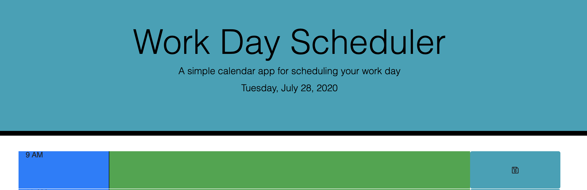
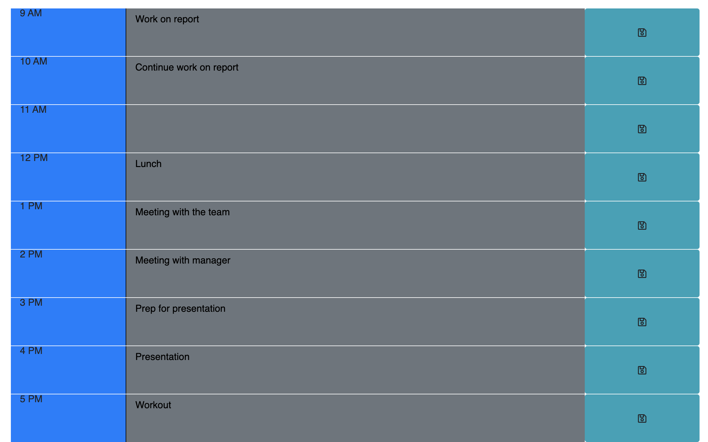

# work-day-scheduler

## Schedule time using the work day scheduler 

[Deployed Application Link](https://melaniede.github.io/work-day-scheduler/)

## Summary
The work day scheduler allows you to plan for your day ahead. Use the input box to plan what's going on in your day and hit the save button to save the entry. Your entry should be there the next time you visit the site. Visual queues were added to the input boxes. Grey means that hour blocked has passed, green means that hour block is upcoming, and red means the time is currently in that hour block. 

### View of Jumbotron


### View of Schedule



## User Story

```
AS AN employee with a busy schedule
I WANT to add important events to a daily planner
SO THAT I can manage my time effectively
```

## Acceptance Criteria

```
GIVEN I am using a daily planner to create a schedule
WHEN I open the planner
THEN the current day is displayed at the top of the calendar
WHEN I scroll down
THEN I am presented with timeblocks for standard business hours
WHEN I view the timeblocks for that day
THEN each timeblock is color coded to indicate whether it is in the past, present, or future
WHEN I click into a timeblock
THEN I can enter an event
WHEN I click the save button for that timeblock
THEN the text for that event is saved in local storage
WHEN I refresh the page
THEN the saved events persist
```
